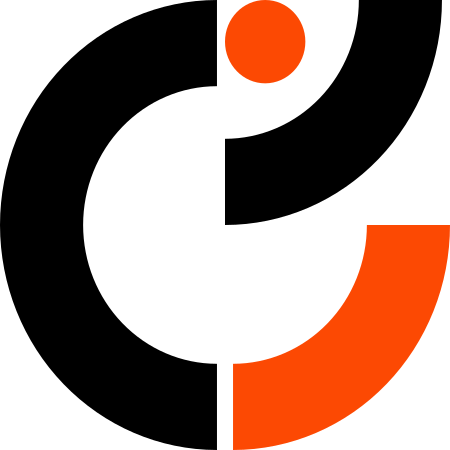
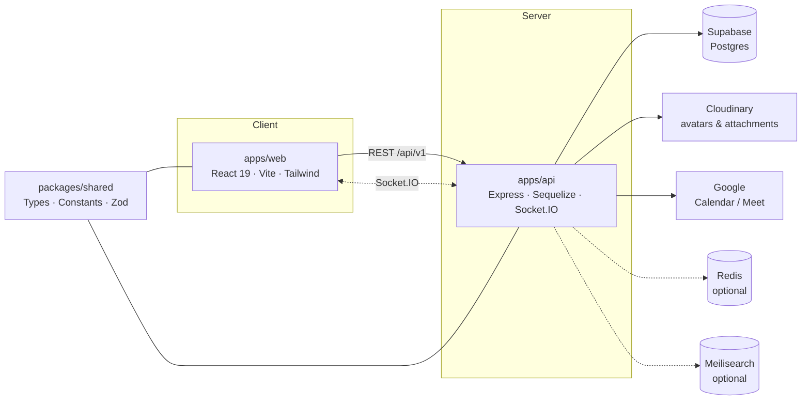

<div align="center">



# Teakflow

**The calm internal workspace for Codeteak.**
Daily work · Real-time chat · Google Meet — in one quiet place.

<br />


<br />

[Overview](#overview) ·
[Features](#features) ·
[Roles](#roles--access) ·
[Architecture](#architecture) ·
[Quick start](#quick-start) ·
[Scripts](#scripts) ·
[Docs](#documentation) ·
[Design](#design-system)

</div>

<br />

---

## Overview

**Teakflow** is Codeteak's internal product for the end of the working day. It is deliberately **not** a project board, **not** a CRM, and **not** surveillance software.

People write down what they shipped, talk to their team in real time, and start a Google Meet — all from one place.

<table>
  <tr>
    <td width="25%" valign="top">
      <h4>Accountability</h4>
      One daily notebook per person, per work date.
    </td>
    <td width="25%" valign="top">
      <h4>Communication</h4>
      DMs, groups and channels — membership only.
    </td>
    <td width="25%" valign="top">
      <h4>Meetings</h4>
      Google Meet via Calendar. No custom video stack.
    </td>
    <td width="25%" valign="top">
      <h4>Quiet Desk</h4>
      Paper UI, one accent <code>#FC4903</code>, zero dashboard noise.
    </td>
  </tr>
</table>

---

## Features

### Daily work

| Capability | Details |
| :-- | :-- |
| **Evening window** | Submissions open only inside the configured company window — judged on **server time**, never the browser clock. |
| **Notebook** | Write what you worked on with headings, lists and emphasis. Paste / cut is discouraged on purpose. |
| **Same-day edit** | After submitting, your own notebook stays editable for that work date. Past days lock. |
| **Work / Plan** | *Work* is the submitted notebook. *Plan* is tomorrow's intent — never copy-from-yesterday. |
| **Team view** | Admin / Manager / Lead read notebooks inside their reporting tree. Employees only see their own. |
| **Reminders** | Optional notifications when the window opens and before it closes. |

### Chat

| Capability | Details |
| :-- | :-- |
| **Direct messages** | Search anyone in the company and start a DM. |
| **Groups & channels** | Public rooms follow company or reporting-tree rules; private rooms stay invite-only. |
| **Realtime** | Socket.IO — messages are persisted first, then emitted. |
| **Threads & reactions** | Replies stay readable; reactions update live. |
| **Mentions** | `@` autocomplete with mention notifications. |
| **Search** | Meilisearch — text, people, typo tolerance. Only conversations you belong to. |
| **Presence** | Online, Away, Do not disturb. |

### Meetings

| Capability | Details |
| :-- | :-- |
| **Google Meet** | Creates Calendar events with Meet links through the company OAuth connection. |
| **Invites** | Scoped to Admin (company-wide) or Manager / Lead (reporting tree). |
| **Chat cards** | Meetings started from a conversation post back into the same thread. |
| **Reminders** | On creation and roughly 15 minutes before the start. |

### Sales (Yaadro)

| Capability | Details |
| :-- | :-- |
| **Field day** | Save visit, received payment and fuel separately. |
| **Daily work link** | Each visit is appended to that date's notebook. |
| **Shop directory** | Admin / Manager / Lead can add, edit, delete and bulk upsert. |
| **Payments** | Drive yearly workbook + Postgres ledger; executives can edit allowed cells only. |
| **CSV** | Preview the sheet first — download only after confirming. |

### Admin & platform

| Capability | Details |
| :-- | :-- |
| **People** | Create, edit, restrict / restore; roles, designations and reports-to. |
| **Settings** | Company timezone, daily-work window, length, late rules and reminders. |
| **Channels** | Create and delete company channels. |
| **Audit logs** | A trail of the actions that matter for accountability. |
| **PWA** | Installable app, offline GET cache, mobile bottom navigation. |
| **Hardening** | Rate limiting, Helmet, CORS, Docker and CI. |

---

## Roles & access

| Role | Scope | Can do |
| :-- | :-- | :-- |
| **Admin** | Whole company | People, settings, channels, all daily work, Google connect, audit logs |
| **Manager** | Reporting tree (may head multiple departments) | Team daily work, meetings within scope |
| **Lead** | Direct reports only | Team daily work and invites within that scope |
| **Employee** | Self | Own daily work, chat, meetings they are invited to |

> [!NOTE]
> Job titles are **designations**, not extra logins. A designation never changes what someone can access — the role does.

---

## Architecture



### Tech stack

| Layer | Choice |
| :-- | :-- |
| **Frontend** | React 19 · Vite · Tailwind |
| **Backend** | Node · Express · TypeScript · Sequelize · Socket.IO |
| **Shared** | Types · constants · Zod schemas |
| **Data** | Supabase Postgres (`DATABASE_URL`) |
| **Files** | Cloudinary (avatars & chat attachments) |
| **Realtime** | Socket.IO (+ local Redis, optional) |
| **Search** | Meilisearch (local, optional) |
| **Meetings** | Google Calendar / Meet OAuth |
| **Tooling** | pnpm · Turborepo · Vitest · Playwright · Docker |

### Repository layout

```text
Codeteak Work Progress/
├── apps/
│   ├── web/                 # Quiet Desk client
│   └── api/                 # Express API + sockets
├── packages/
│   ├── shared/              # Shared contracts
│   ├── typescript-config/
│   └── eslint-config/
├── docs/                    # Spec, tasks, theme, agents
└── .github/workflows/       # CI
```

---

## Quick start

### Prerequisites

| Requirement | Version |
| :-- | :-- |
| Node.js | `≥ 22.13` |
| pnpm | `11` |
| Docker | Needed for Redis / Meilisearch |

### Run it locally

```bash
# 1. Install dependencies
pnpm install

# 2. Configure the environment
cp .env.example .env
#    Fill in DATABASE_URL, Supabase, Cloudinary and JWT secrets.
#    Optional: apps/web/.env for VITE_* public keys only.

# 3. Start Redis + Meilisearch
pnpm redis:up

# 4. Seed the demo company tree
pnpm seed

# 5. Start web + API
pnpm dev
```

| App | URL |
| :-- | :-- |
| **Web** | http://localhost:5173 |
| **API** | http://localhost:3005 · base path `/api/v1` |

<details>
<summary><strong>Demo logins</strong> (seeded data only)</summary>

<br />

All seeded accounts use the password **`password@1234`**.

| Email | Purpose |
| :-- | :-- |
| `admin@codeteak.com` | Admin |
| `nisha@codeteak.com` | Demo user |
| `asha@codeteak.com` | Demo user |

> [!WARNING]
> These credentials exist for local development only. Never seed them into a shared or production database.

</details>

---

## Scripts

| Command | Purpose |
| :-- | :-- |
| `pnpm dev` | Run web + API |
| `pnpm build` | Production build |
| `pnpm typecheck` | TypeScript across the monorepo |
| `pnpm lint` | ESLint |
| `pnpm test` | Vitest (API) |
| `pnpm seed` | Seed admin + demo reporting tree |
| `pnpm redis:up` / `pnpm redis:down` | Start / stop local Redis + Meilisearch |
| `pnpm kill:ports` | Free ports `:5173` and `:3005` |

---

## Documentation

Product truth lives in [`docs/`](docs/). Contributors and agents should read in this order:

| # | Document | Contents |
| :-: | :-- | :-- |
| 1 | [docs/README.md](docs/README.md) | Index |
| 2 | [docs/AGENTS.md](docs/AGENTS.md) | Stack, invariants, what not to build |
| 3 | [docs/spec.md](docs/spec.md) | Full product specification |
| 4 | [docs/THEME.md](docs/THEME.md) | Quiet Desk visual language |
| 5 | [docs/TASKS.md](docs/TASKS.md) | Implementation order |
| 6 | [docs/PRODUCT.md](docs/PRODUCT.md) | Status & vision (not the build contract) |
| 7 | [docs/SALES_DRIVE.md](docs/SALES_DRIVE.md) | Yaadro payment workbook setup |

---

## Design system

**Quiet Desk** — warm paper, cream surfaces, charcoal type, and a single accent.

| Token | Colour | Hex |
| :-- | :-: | :-- |
| Paper |  | `#F4F1EB` |
| Charcoal |  | `#1B1A17` |
| Muted |  | `#6F6B64` |
| **Codeteak Orange** (accent) |  | `#FC4903` |

- **Typography:** Plus Jakarta Sans, with IBM Plex Mono for dates and clocks.
- **Motion:** short and quiet (~160 ms).
- **Never:** gradients, heavy shadows, or analytics wallpaper on Home.

---

## What we will not add

Teakflow's restraint is a feature. The following are out of scope by design:

- ❌ Issue tracking, sprints, Gantt charts, kanban boards, productivity scores
- ❌ Mouse / keyboard tracking, screenshots, webcam capture, keystroke logging
- ❌ Copy-from-yesterday on daily work
- ❌ A custom video conferencing stack

---

<div align="center">


<sub>Built for Codeteak · **Teakflow**</sub>

</div>
